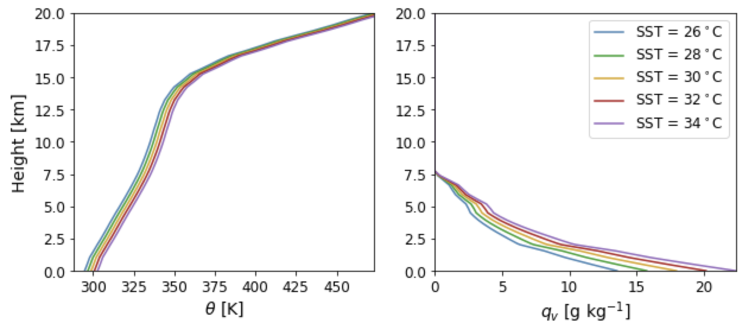
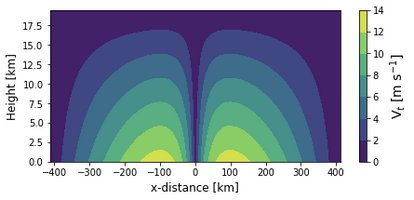
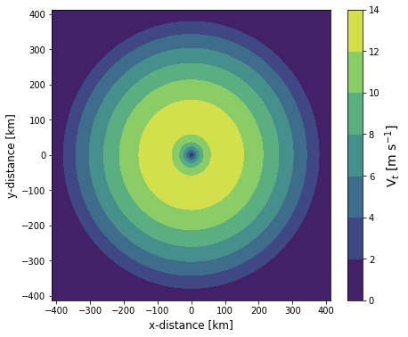

# Running simulations in WRF-LES
Hurricanes of varying size and intensities are simulated using WRF-LES by varying surface temperature, and the initial potential temperature and relative humidity profiles. The WRF v4.1.5 code used to run these simulations can be found here: https://github.com/miguel-sg-2/WRF_hurricane/.
## Initialization
Initializing a hurricane using WRF-LES requires multiple steps:
1. Domain setup.
2. Potential temperature and relative humidity profiles.
3. Velocity fields. 
4. Surface temperature.
### Domain setup
Hurricanes are simulated using a nested mesoscale-microscale domain setup. Three mesoscale domains provide boundary conditions to two LES domains. The mesoscale domains have grid resolution of $\Delta x=13500,4500,1500$ m. The LES domains have a grid resolution of $\Delta x=166.667,555.5556$ m. An example of the domain configuration for the $34\degree C$ hurricane simulations is as follows:
```
 &domains
 ...
 max_dom                             = 5,
 s_we                                = 1,   1,   1,   1,   1,  
 e_we                                = 301, 322, 322, 865, 1603, 
 s_sn                                = 1,   1,   1,   1,   1,  
 e_sn                                = 301, 322, 322, 865, 1603, 
 dx                                  = 13500, 4500, 1500, 166.667, 55.5556,
 dy                                  = 13500, 4500, 1500, 166.667, 55.5556,
 i_parent_start                      = 1, 100, 100, 81, 182, 
 j_parent_start                      = 1, 100, 87,  69, 174,
 parent_grid_ratio                   = 1, 3,  3,  9,  3,
 ...
```
Note that sometimes the hurricane drifts within the mesoscale domains. Therefore, the relative location of each nested domain may vary.
The `namelist.input` file for each hurricane is located at `/pl/active/JKL_IDEAL/hurricanes/sst_*/initial/` or at `HurricaneSimulations/initialization/namelists/`.
### Potential temperature and relative humidity profiles
The initial potential temperature and relative humidity profiles in the simulations are obtained from Jordan, C. L. (1958) "Mean soundings for the west indies area". The potential temperature and relative humidity profiles in the `input_sounding` files are modified to account for different surface temperatures at initialization.
$\theta(z)=\theta_0 + (T_s - 28 \degree C)$
$q_v(z)=q_{v0}(1\pm 0.07^{T_s - 28 \degree C})$

The `input_sounding` file for each hurricane is located at `/pl/active/JKL_IDEAL/hurricanes/sst_*/initial/`.
### Velocity fields and surface temperature
In ideal WRF-LES, the velocity field at initialization is specified as a velocity profile in the `input_sounding` file. Because the velocity profile is the same over the entire domain $(u(x,y,z) = u(z))$, we run the outermost mesoscale domain for two time steps and modify a restart file instead. To initialize a vortex that may evolve into a cyclone, we modify the velocity fields from one restart file using the `modify_input.py` script.

The `modify_input.py` script creates an axisymmetric vortex defined by the height of zero winds, radius of zero winds, radius of maximum winds, and maximum wind speed. These parameters remain unchanged between the different  hurricane simulations.

To run the `modify_input.py` script, a restart file from the outermost mesoscale domain is needed. The output from the `modify_input.py` script is a new restart file with the name specified by the `modified_input` variable.
```
input_largeDomain   <--- original restart file from WRF
modified_input      <--- restart file with modified velocity fields and surface temperature
```
The `modify_input.py` script rewrites the `U,V` variables in the `input_largeDomain` file to initialize the axisymmetric vortex. The `modify_input.py` script also specifies temperature at the surface for the hurricane simulation. The skin temperature in in the `input_largeDomain` file is modified to the desired surface temperature. The modified restart file is saved as a new netcdf file with the name specified by the `modified_input` variable.
The new `modified_input` file can now be used to run the hurricane simulations.
An example `modify_input.py` script for each hurricane is located at `HurricaneSimulations/initialization/` or at `/pl/active/JKL_IDEAL/hurricanes/sst_*/initial/`.
# Analyzing data from simulations
Because of the large amount of data generated from the hurricane simulations, we process the data from each hurricane separately. The post processed data is saved and compared between the different hurricanes.
## Processing data for one hurricane
### Hurricane center
Because the hurricane sometimes drifts in the LES domains, we track the center of the hurricane using the three-dimensional output from WRF.
The temporal evolution of the hurricane center throughout the simulated period is obtained using the `hurr_center.py` script.
The `hurr_center.py` script extracts the three-dimensional velocity fields and determines the hurricane center as the minimum velocity within the hurricane eyewall. The three-dimensional output from WRF is expected to be merged into a single file. The 3D output from WRF can be combined into a single file using nco as follows:
```
ncecat -O auxH*d05* merged_d05.nc
```
The `hurr_center.py` script creates two text files (`center_x.txt` and `center_y.txt`) that track the temporal evolution of the `x` and `y` location of the hurricane center.
An example `hurr_center.py` script is located at `HurricaneSimulations/postprocessing/`.
### Time series output
Time series output is analyzed in the `hurr_stats_IEC.ipynb` Jupyter notebook. The `hurr_stats_IEC.ipynb` notebook loads the time series output for the desired domain, the relative location of each "met-tower" within the domain (i.e., `tslist` file) and the temporal evolution of the hurricane center (i.e., `center_*.txt` files).
The `hurr_stats_IEC.ipynb` Jupyter notebook calculates the following:
1. 10-min wind statistics over turbine rotor layer.
2. 3-sec wind statistics over turbine rotor layer.
3. 10-sec yaw misalignment at hub height.
4. 10-sec wind veer over turbine rotor layer.
5. Power law fit to 3-sec and 10-min wind profiles.
6. Standard deviation of horizontal wind speed at hub height (using 10-min statistics).
7. Maximum 1-min wind speed at 10 m above the surface.
Statistics relevant for wind turbine design are saved in text files to be compared between the different hurricane simulations.

The following scripts can be used to compare statistics between the different hurricanes:
- `compare_alphaDistr.ipynb`: compare power law fit (10-min and 3-sec).
- `compare_max1minWS_copy.ipynb`:  compare 1-min winds at the surface to define hurricane category.
- `compare_radialWSprof_3s_10m.ipynb`: compare 10-min and 3-sec averaged wind profiles at different radial locations.
- `compare_stdDistr.ipynb`: compare probability distributions of the standard deviation of the horizontal wind at hub height for different radial locations.
- `compare_Veer.ipynb`: compare radial variation in wind veer.
- `compare_ws_pdfs.ipynb`: compare probability distributions for 10-min and 3-sec winds at hub height.
- `compare_yawMis.ipynb`: compare probability distributions of the yaw misalignment at hub height for different radial locations.

These scripts can be found here: `HurricaneSimulations/postprocessing/`.
